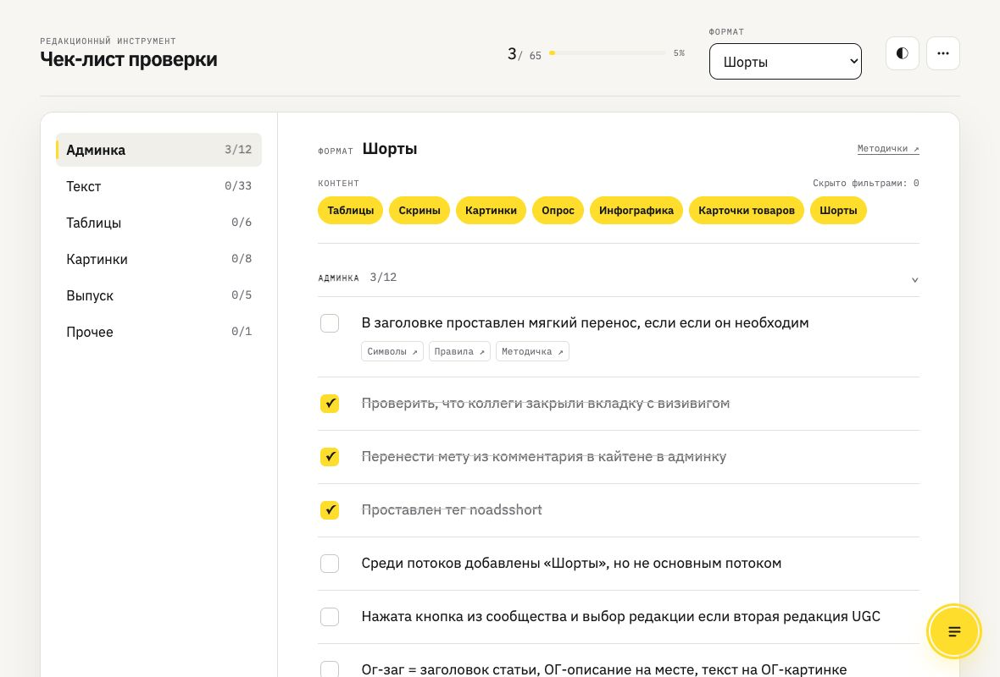
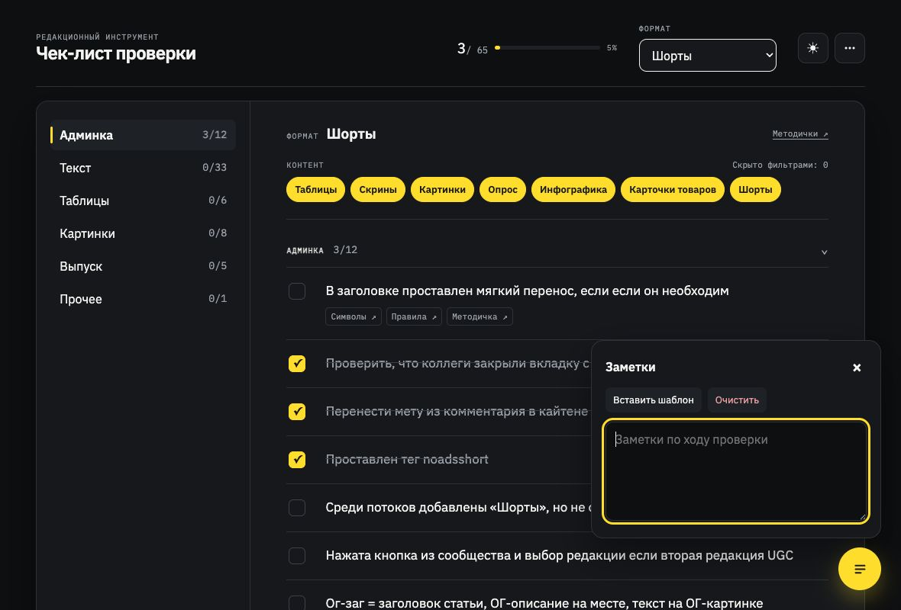
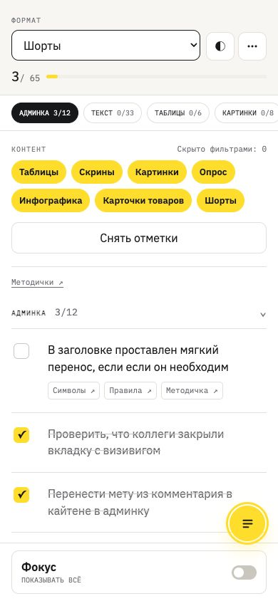

# Первый проход исправлений — 2026-08-04

## Закрыто

1. Тёмная тема теперь применяет светлый основной текст ко всей странице и окну заметок.
2. Селектор формата перенесён в шапку и остаётся доступным на desktop и mobile.
3. Действие «Снять отметки» доступно рядом с фильтрами на mobile.
4. Grid/flex min-content больше не обрезает строки задач и длинные ссылки на ширине 390 px.
5. В навигации подсвечивается один текущий раздел; mobile-чипы обновляют состояние при прокрутке.

## Контрольные кадры

### Desktop light

### Desktop dark + notes

### Mobile 390 px

## Проверки

- `npm run lint` — пройдено.
- `npm run test` — 7/7 пройдено.
- `npm run build` — пройдено.
- `npm run test:e2e` — 22 пройдено, 4 visual/matrix-пропуска ожидаемы.
- `git diff --check` — пройдено.
- Добавлены e2e-регрессии для реального контраста тёмной темы и отсутствия визуально обрезанного mobile-контента.
