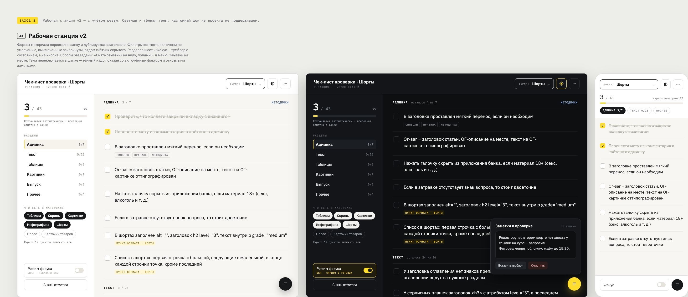
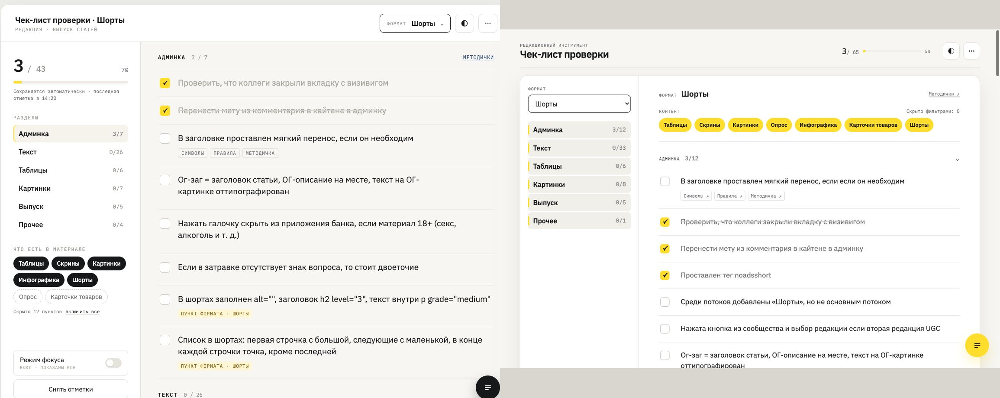
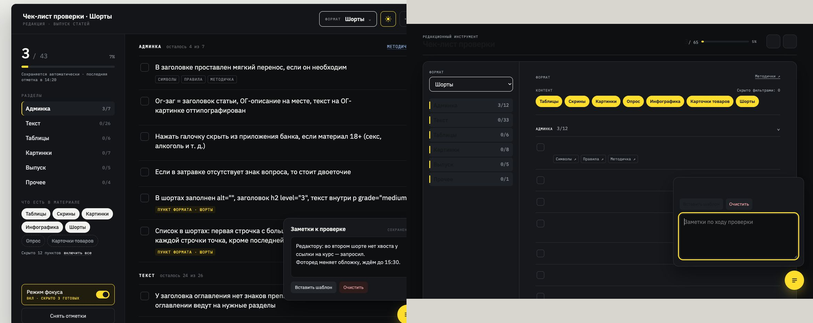
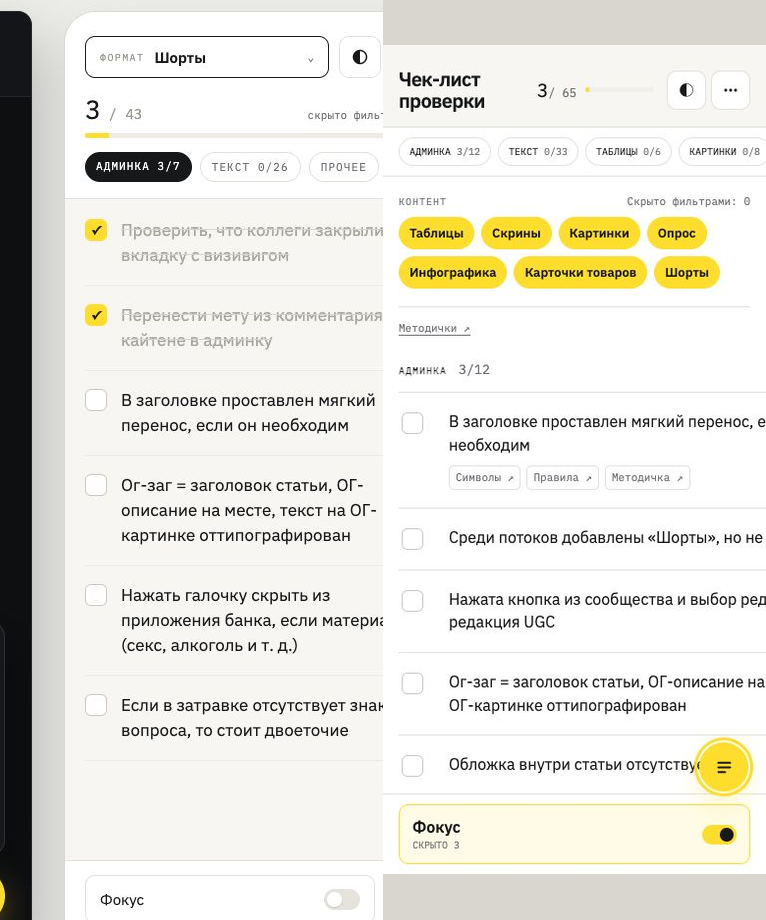

# Ревью редизайна — 2026-08-04

## Объём проверки

- Визуальная цель: `Чек-лист выпуска - направления (offline).html`, направление «Рабочая станция v2».
- План и принятые решения: `ROADMAP_РЕДИЗАЙН.md`, `СЕРЫЕ_ЗОНЫ_РЕДИЗАЙН.md`.
- Функциональный контракт: `Чек-лист проверки_ краткая инструкция.pdf` (7 страниц просмотрены).
- Реализация: desktop 1180×800, mobile 390×844, светлая и тёмная темы, фокус и заметки.

## Итог

Редизайн узнаваемо следует выбранному направлению и в светлой desktop-версии уже близок по визуальному языку, но пока не готов к визуальной приёмке. Есть один критический дефект тёмной темы и два серьёзных mobile-дефекта. Visual baseline создавать рано.

## Кадры и состояние шагов

### 0. Эталон — здоров

Зафиксированы светлая desktop-тема, тёмная desktop-тема с фокусом и заметками, mobile 390 px.

### 1. Desktop light — частично соответствует

Сильные стороны: IBM Plex подключён локально; тёплая нейтральная палитра, жёлтый акцент, строки задач, чекбоксы, фильтры, радиусы и общая двухколоночная композиция согласованы с направлением. Заметны доступные focus-visible состояния и достаточные размеры интерактивных целей.

Расхождения: селектор формата находится в сайдбаре, а не в шапке; в сайдбаре нет блока общего прогресса; жёлтая метка «активного» раздела показана у всех раскрытых разделов; плотность и иерархия шапки отличаются от макета.

### 2. Desktop dark + focus + notes — критический дефект

Фон и поверхности переключаются в тёмную тему, но основной цвет текста остаётся `#17181a`. На фоне `#0e0f11` это около `1.08:1`, поэтому заголовок, строки задач, навигация и заголовок заметок почти исчезают. Причина: `color: var(--ink)` вычисляется на `body`, а новые переменные темы объявлены ниже на `.app-dark`; `.app` не задаёт цвет заново.

### 3. Mobile 390 px — не готов

Формат нельзя сменить: единственный `select` находится внутри desktop-сайдбара, который скрывается при ширине до 800 px. Это прямое расхождение с mobile-макетом, где формат остаётся в шапке.

Список задач также обрезается справа. При ширине контента 358 px CSS Grid создаёт колонку примерно 523 px из-за min-content размера; `overflow: hidden` на оболочке маскирует проблему, поэтому формальная проверка `document.scrollWidth <= innerWidth` проходит, хотя текст визуально недоступен.

## Приоритетные замечания

1. **P0 — тёмная тема нечитаема.** Задать `color: var(--ink)` на `.app` (или перенести тему на корневой элемент) и повторно проверить все поверхности, popover и disabled/muted состояния.
2. **P1 — на mobile отсутствует выбор формата.** Вынести подписанный селектор в шапку/отдельный mobile-контрол и не прятать единственную точку смены формата вместе с сайдбаром.
3. **P1 — mobile-строки обрезаются.** Ограничить grid/flex min-content (`grid-template-columns: minmax(0, 1fr)`, `min-width: 0` для секций и `.task-copy`) и проверять реальные bounding boxes, а не только ширину документа.
4. **P2 — навигация показывает все раскрытые разделы как активные.** Состояние active нельзя выводить из `collapsed`; нужен один текущий раздел или только hover/expanded-стиль без активной жёлтой метки.
5. **P2 — композиция desktop не полностью повторяет цель.** Вернуть формат в шапку и общий прогресс в сайдбар либо явно зафиксировать это как согласованное отступление от макета.

## Проверки

- `npm run lint` — пройдено.
- `npm run test` — 7/7 пройдено.
- `npm run build` — пройдено.
- `npm run test:e2e` — 16 пройдено, 4 mobile-теста упали, 4 пропущены. Все четыре падения связаны с отсутствующим на mobile combobox «Формат».
- Visual-тесты намеренно пропущены; baseline пока создавать не следует.

## Пределы проверки

Скриншоты и DOM подтверждают визуальные и часть семантических рисков, но не доказывают полное соответствие WCAG. Отдельно не проверялись screen reader, масштаб 200–400%, forced colors и все комбинации пресетов/фильтров.
